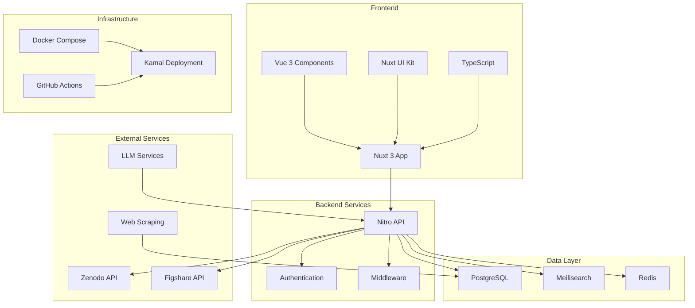

# Overall Architecture

The core of Posters.science is a **Nuxt 3** application, a meta-framework built on top of **Vue 3**. This unified architecture enables the development of a single web application that handles both the user-facing interface and backend API requests.

## Core Framework

### Nuxt 3 + Vue 3

- **Unified Application**: Single codebase for frontend and backend
- **Nuxt UI**: Comprehensive UI kit with pre-built components and design system
- **TypeScript**: Full-stack type safety and early bug detection
- **Server-Side Rendering (SSR)**: Improved security and performance
- **Nitro Engine**: Powers backend logic and API routes

### Benefits of SSR

- **Enhanced Security**: Authentication processes are hardened
- **Better Performance**: Pages rendered directly from server
- **SEO Optimization**: Content easily indexed by search engines
- **Reduced SPA Risks**: Minimizes common single-page application vulnerabilities

## Data Architecture

### Database Layer

- **PostgreSQL**: Primary database for poster metadata, user information, and system state
- **Prisma ORM**: Type-safe database interactions and migrations
- **pgvector**: Vector storage for embeddings and similarity search

### Search & Caching

- **Meilisearch**: Fast, scalable search service for poster discovery
- **Redis**: Key-value storage for caching and session management

### External Integrations

- **Repository APIs**: Zenodo, Figshare for poster hosting
- **Authentication**: Nuxt Auth with ORCID integration for user management across services
- **Email Services**: Resend for transactional communications

## Microservices Architecture

### LLM Services

- **Local GPU Compute**: Handles retrieval-augmented generation
- **Poster Summarization**: AI-powered content analysis
- **Natural Language Queries**: Conversational search capabilities

### Web Scraping Service

- **Dedicated VM**: Python-based scraping infrastructure
- **Automated Collection**: Extracts posters from non-API repositories

## Deployment & Infrastructure

### Containerization

- **Docker Compose**: Defines all services in reproducible environments

### Deployment Strategy

- **Kamal**: Single Linux server deployment
- **GitHub Actions**: Automated CI/CD pipeline
- **Secure Secrets**: SSH keys and credentials stored as GitHub Secrets

### Scalability

- **Current**: Single server with Docker Compose
- **Future**: Kubernetes for multi-node orchestration

## Documentation

- **VitePress**: Technical and user documentation
- **Markdown**: Clear, maintainable documentation format

## Architecture Diagram

