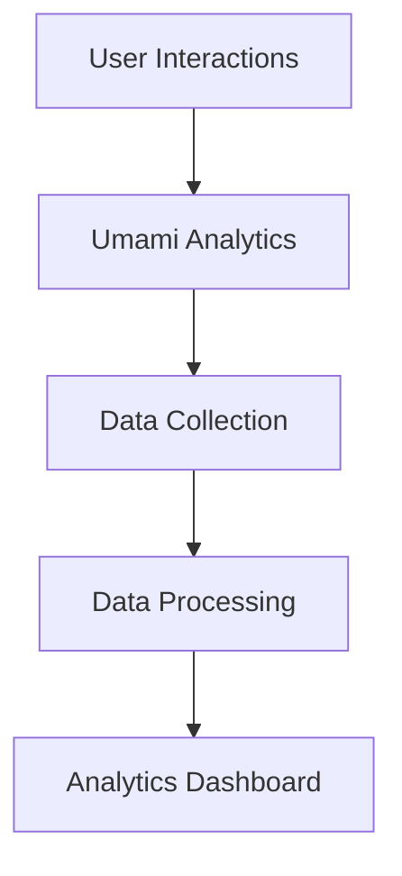

# Analytics

## Analytics Stack

### Primary Tool

- **Umami**: Privacy-friendly, open-source analytics platform

### Analytics Architecture



## Key Metrics

### User Engagement

- **Page Views**: Content consumption patterns
- **Session Duration**: User engagement time
- **Bounce Rate**: Single-page session percentage

### Platform Usage

- **Search Queries**: Search behavior analysis
- **Smart Search Usage**: LLM-powered natural language queries
- **Metadata Corrections**: User-driven metadata improvements
- **Poster Views**: Content access patterns
- **Submission Activity**: User contribution metrics
- **Feature Usage**: Platform feature adoption

### Performance Metrics

- **Page Load Times**: User experience metrics
- **API Response Times**: Backend performance
- **Error Rates**: System reliability metrics

## Implementation

### Frontend Analytics

```javascript
// Example: Frontend analytics tracking
import { trackEvent } from "@/utils/analytics";

// Track user interactions
export function trackPosterSearch(query, resultsCount) {
  trackEvent("poster_search", {
    query: query,
    results_count: resultsCount,
    search_type: "text",
  });
}

// Track page views
export function trackPageView(page, metadata = {}) {
  trackEvent("page_view", {
    page: page,
    ...metadata,
  });
}

// Track user actions
export function trackUserAction(action, context = {}) {
  trackEvent("user_action", {
    action: action,
    ...context,
  });
}
```

### Backend Analytics

```typescript
// Example: Backend analytics tracking
import { analytics } from "@/utils/analytics";

export default defineEventHandler(async (event) => {
  const startTime = Date.now();

  try {
    const result = await processRequest(event);

    // Track successful API calls
    analytics.track("api_success", {
      endpoint: event.url,
      method: event.method,
      response_time: Date.now() - startTime,
      user_id: getUserId(event),
    });

    return result;
  } catch (error) {
    // Track API errors
    analytics.track("api_error", {
      endpoint: event.url,
      method: event.method,
      error: error.message,
      response_time: Date.now() - startTime,
      user_id: getUserId(event),
    });

    throw error;
  }
});
```

## Data Collection

### Event Tracking

- **Page Navigation**: Page view and navigation patterns
- **Search Behavior**: Search queries and result interactions
- **Content Engagement**: Poster view and download patterns

## Compliance and Ethics

### Data Ethics

- **Transparency**: Clear data collection practices
- **Data Minimization**: Collect only necessary data
- **Purpose Limitation**: Use data only for stated purposes

### Regulatory Compliance

- **GDPR**: European data protection compliance
- **CCPA**: California privacy law compliance
- **COPPA**: Children's privacy protection
