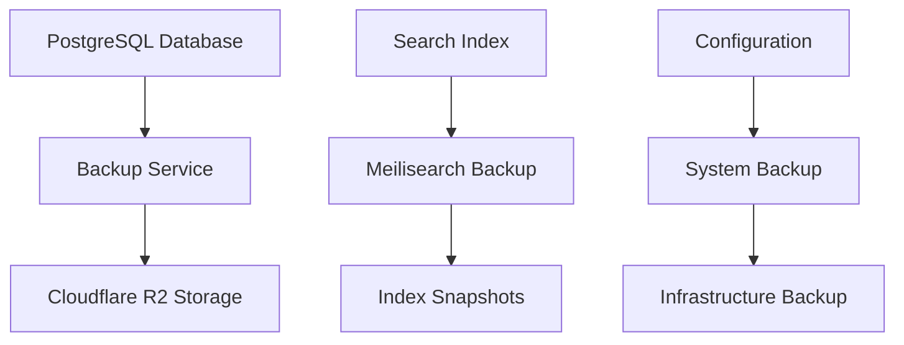

# Data Backups & Recovery

Comprehensive backup and recovery systems ensure data protection and regulatory compliance for the Posters.science platform. This section covers backup strategies, recovery procedures, and data protection measures.

## Backup Architecture



### Primary Storage

- **Cloudflare R2**: Primary backup storage for metadata and system data

## Backup Types

### Database Backups

- **Full Backups**: Complete database snapshots

### Search Index Backups

- **Meilisearch Snapshots**: Complete search index backups
- **Index Metadata**: Search configuration and settings

## Backup Implementation

### Automated Backup Schedule

```bash
# Example: Daily backup script
#!/bin/bash

# Database backup
pg_dump -h localhost -U postgres posters_science > /backup/db_$(date +%Y%m%d).sql

# Compress backup
gzip /backup/db_$(date +%Y%m%d).sql

# Upload to Cloudflare R2
rclone copy /backup/db_$(date +%Y%m%d).sql.gz r2:posters-science-backups/

# Cleanup local files older than 7 days
find /backup -name "*.sql.gz" -mtime +7 -delete
```

### Backup Configuration

- **Daily Backups**: Full database backups every 24 hours
- **Hourly Incrementals**: Transaction log backups every hour
- **Weekly Archives**: Long-term storage for compliance

### Storage Management

- **Retention Policies**: Automated cleanup of old backups
- **Compression**: Efficient storage utilization
- **Encryption**: Secure backup data protection
- **Versioning**: Multiple backup versions for recovery options

## Recovery Procedures

### Database Recovery

#### Full Database Restore

```bash
# Download backup from Cloudflare R2
rclone copy r2:posters-science-backups/db_20240115.sql.gz /restore/

# Decompress backup
gunzip /restore/db_20240115.sql.gz

# Restore database
psql -h localhost -U postgres -d posters_science < /restore/db_20240115.sql
```

### Search Index Recovery

#### Meilisearch Index Restore

```bash
# Stop Meilisearch service
systemctl stop meilisearch

# Restore index from snapshot
meilisearch --import-snapshot /backup/meilisearch_snapshot_20240115

# Start Meilisearch service
systemctl start meilisearch
```
