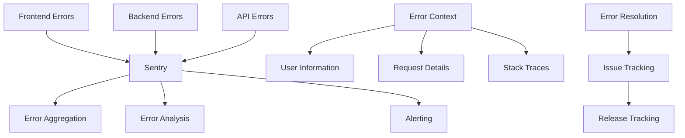

# Error Tracking

Comprehensive error tracking provides real-time visibility into application failures, exceptions, and issues across the Posters.science platform. This enables rapid issue identification, debugging, and resolution.

## Error Tracking Stack

### Primary Tool

- **Sentry**: Real-time error monitoring and alerting

### Error Tracking Architecture



## Error Categories

### Frontend Errors

- **JavaScript Exceptions**: Runtime errors and exceptions
- **Promise Rejections**: Unhandled promise rejections
- **Network Errors**: API call failures and timeouts
- **UI Errors**: Component rendering and interaction errors

### Backend Errors

- **API Exceptions**: Server-side error handling
- **Database Errors**: PostgreSQL connection and query errors
- **External Service Errors**: Third-party API failures
- **Authentication Errors**: User authentication and authorization issues

### System Errors

- **Infrastructure Errors**: Server and container failures
- **Service Errors**: Microservice communication failures
- **Resource Errors**: Memory, CPU, and storage issues
- **Configuration Errors**: System configuration problems

## Implementation

### Frontend Error Tracking

```javascript
// Example: Frontend error tracking setup
import * as Sentry from "@sentry/vue";

// Initialize Sentry
Sentry.init({
  dsn: process.env.SENTRY_DSN,
  environment: process.env.NODE_ENV,
  integrations: [new Sentry.BrowserTracing(), new Sentry.Replay()],
  tracesSampleRate: 0.1,
  replaysSessionSampleRate: 0.1,
  replaysOnErrorSampleRate: 1.0,
});

// Custom error handling
window.addEventListener("unhandledrejection", (event) => {
  Sentry.captureException(event.reason, {
    tags: {
      error_type: "unhandled_promise_rejection",
    },
    extra: {
      promise: event.promise,
      reason: event.reason,
    },
  });
});
```

### Backend Error Tracking

```typescript
// Example: Backend error tracking
import * as Sentry from "@sentry/node";

// Initialize Sentry
Sentry.init({
  dsn: process.env.SENTRY_DSN,
  environment: process.env.NODE_ENV,
  integrations: [
    new Sentry.Integrations.Http({ tracing: true }),
    new Sentry.Integrations.Express({ app }),
    new Sentry.Integrations.Postgres(),
  ],
  tracesSampleRate: 0.1,
});

// Error handling middleware
export default defineEventHandler(async (event) => {
  try {
    return await processRequest(event);
  } catch (error) {
    Sentry.captureException(error, {
      tags: {
        service: "posters-api",
        endpoint: event.url,
        method: event.method,
      },
      user: {
        id: getUserId(event),
        email: getUserEmail(event),
      },
      extra: {
        request_id: getRequestId(event),
        user_agent: getHeader(event, "user-agent"),
        ip_address: getClientIP(event),
      },
    });

    throw error;
  }
});
```

### Custom Error Tracking

```typescript
// Example: Custom error tracking
import { logger } from "@/utils/logger";

export class PosterProcessingError extends Error {
  constructor(
    message: string,
    public posterId: string,
    public processingStep: string
  ) {
    super(message);
    this.name = "PosterProcessingError";

    // Log to Sentry with custom context
    Sentry.captureException(this, {
      tags: {
        error_type: "poster_processing",
        processing_step: processingStep,
      },
      extra: {
        poster_id: posterId,
        processing_step: processingStep,
      },
    });
  }
}
```

## Error Context

### User Context

- **User Information**: User ID, email, role
- **Session Data**: Session ID, login time
- **User Preferences**: Settings and configurations
- **User Actions**: Recent user activities

### Request Context

- **Request Details**: URL, method, headers
- **Request Parameters**: Query parameters, body data
- **Request ID**: Unique request identifier
- **Timing Information**: Request duration and timing

### System Context

- **Environment**: Development, staging, production
- **Version Information**: Application and dependency versions
- **Configuration**: System configuration settings
- **Resource Usage**: CPU, memory, disk usage

## Alerting and Notifications

### Notification Channels

- **Email Notifications**: Critical error alerts
- **Slack Integration**: Team communication

### Alert Examples

- **High Error Rate**: Error rate > 5% for 5 minutes
- **New Error Type**: Previously unseen error pattern
- **Critical Error**: Fatal errors or system failures
- **Error Spike**: Sudden increase in error frequency
