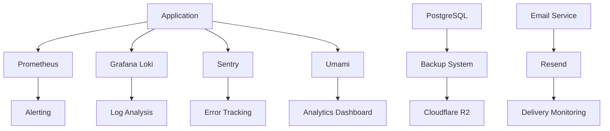

# Monitoring & Observability

The Posters.science platform implements a comprehensive monitoring and observability stack to ensure system health, performance, and security. This section covers the monitoring infrastructure, tools, and practices used to maintain platform reliability.

## Key Components

- **Application Monitoring**: Real-time performance and health tracking
- **Logging**: Centralized log management and analysis
- **Error Tracking**: Comprehensive error monitoring and alerting
- **User Analytics**: Privacy-friendly usage analytics
- **Data Backups**: Automated backup and recovery systems
- **Email Services**: Transactional email monitoring

## Monitoring Architecture

### System Overview

## Application Monitoring

Prometheus or server-native monitoring tracks backend health:
- API latency
- Search indexing
- LLM performance
- Job completion

Alerts route via email or Slack. Synthetic monitoring tests end-to-end workflows.

## Logging

Grafana Loki (or Azure Log Analytics) centralizes logs including:
- Request traces
- Job results
- Errors

## Error Tracking

Sentry monitors real-time errors across Nuxt frontend and server-side APIs, capturing exceptions and broken flows.

## User Analytics

Umami tracks anonymous usage metrics:
- Searches
- Metadata corrections
- LLM queries

## Data Backups

Nightly Postgres backups export to Cloudflare R2 storage, covering:
- Metadata
- poster.json versions
- Sessions
- Embeddings

## Email Services

Resend handles transactional emails:
- Verification
- Password resets
- DOI confirmations

## Implementation Strategy

### Tool Selection Criteria

- **Open Source**: Cost-effective and customizable solutions
- **Integration**: Seamless integration with existing stack
- **Scalability**: Growth-ready monitoring infrastructure
- **Privacy**: User privacy protection and compliance

### Incremental Rollout

Tools will be introduced incrementally based on deployment scale, starting with health checks and Sentry integration.
