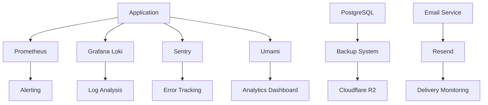

# Monitoring & Observability

The Posters.science platform implements a comprehensive monitoring and observability stack to ensure system health, performance, and security. This section covers the monitoring infrastructure, tools, and practices used to maintain platform reliability.

## Key Components

- [**Application Monitoring**](./application.md): Real-time performance and health tracking
- **Logging**: Centralized log management and analysis
- [**Error Tracking**](./errors.md): Comprehensive error monitoring and alerting
- [**User Analytics**](./analytics.md): Privacy-friendly usage analytics
- [**Data Backups**](./backups.md): Automated backup and recovery systems
- **Email Services**: Transactional email monitoring

## Monitoring Architecture

### System Overview

## Implementation Strategy

### Tool Selection Criteria

- **Open Source**: Cost-effective and customizable solutions
- **Integration**: Seamless integration with existing stack
- **Scalability**: Growth-ready monitoring infrastructure
- **Privacy**: User privacy protection and compliance
