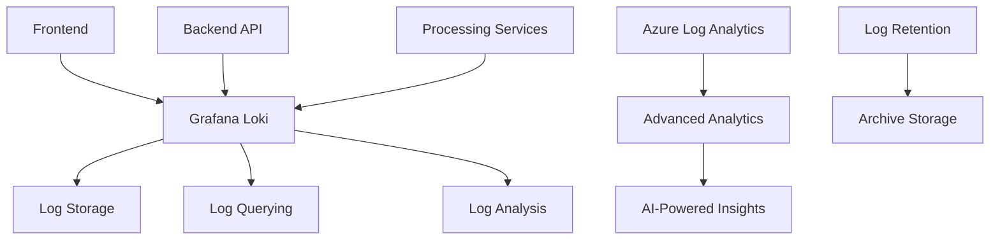

# Logging

Centralized logging provides comprehensive visibility into system behavior, user actions, and operational events across the Posters.science platform. This enables effective debugging, auditing, and system analysis.

## Logging Architecture

### Centralized Log Management



### Primary Tools

- **Grafana Loki**: Log aggregation and querying
- **Structured Logging**: JSON-formatted log entries
- **Log Correlation**: Request tracing across services
- **Real-time Analysis**: Live log monitoring

## Log Categories

### Application Logs

- **Request Logs**: HTTP request/response tracking
- **Authentication Logs**: User login and session management
- **API Logs**: Backend service interactions

### System Logs

- **Infrastructure Logs**: Server and container logs
- **Database Logs**: PostgreSQL query and connection logs
- **Search Logs**: Meilisearch operation logs
- **Cache Logs**: Redis operation tracking

### Security Logs

- **Access Logs**: User access and permission events
- **Security Events**: Authentication failures, suspicious activity

### Performance Logs

- **Performance Metrics**: Response times, throughput
- **Resource Usage**: CPU, memory, disk utilization
- **Error Logs**: Exception and error tracking
- **Custom Metrics**: Application-specific measurements

## Log Structure

### Standardized Format

```json
{
  "timestamp": "2024-01-15T10:30:00Z",
  "level": "INFO",
  "service": "posters-api",
  "request_id": "req_123456",
  "user_id": "user_789",
  "action": "poster_search",
  "message": "Search query processed",
  "metadata": {
    "query": "alzheimer research",
    "results_count": 25,
    "response_time_ms": 150
  }
}
```

### Log Levels

- **DEBUG**: Detailed diagnostic information
- **INFO**: General information about system operation
- **WARN**: Warning messages for potential issues
- **ERROR**: Error events that don't stop the application
- **FATAL**: Critical errors that cause application failure

## Implementation

### Frontend Logging

```javascript
// Example: Frontend error logging
import { logger } from "@/utils/logger";

try {
  // Application logic
  await submitPoster(data);
} catch (error) {
  logger.error("Poster submission failed", {
    error: error.message,
    stack: error.stack,
    user_id: currentUser.id,
    poster_data: sanitizedData,
  });
}
```

### Backend Logging

```typescript
// Example: Backend request logging
import { logger } from "@/utils/logger";

export default defineEventHandler(async (event) => {
  const startTime = Date.now();
  const requestId = generateRequestId();

  logger.info("API request started", {
    request_id: requestId,
    method: event.method,
    url: event.url,
    user_agent: getHeader(event, "user-agent"),
  });

  try {
    const result = await processRequest(event);

    logger.info("API request completed", {
      request_id: requestId,
      status_code: 200,
      response_time_ms: Date.now() - startTime,
    });

    return result;
  } catch (error) {
    logger.error("API request failed", {
      request_id: requestId,
      error: error.message,
      status_code: 500,
      response_time_ms: Date.now() - startTime,
    });

    throw error;
  }
});
```

## Log Analysis

### Query Capabilities

- **Time-based Queries**: Log analysis over time periods
- **Service Filtering**: Logs from specific services
- **Error Analysis**: Error pattern identification
- **Performance Analysis**: Response time trends

### Common Queries

```logql
# Error rate by service
sum(rate({service="posters-api",level="ERROR"}[5m])) by (service)

# Top slow queries
topk(10, sum(rate({service="posters-db",duration>1000}[5m])) by (query))

# User activity patterns
sum(rate({service="posters-api",action="user_login"}[1h])) by (user_id)
```

## Monitoring and Alerting

### Log-based Alerts

- **Error Rate Alerts**: High error frequency detection
- **Performance Alerts**: Slow response time detection
- **Capacity Alerts**: Storage and processing limits

### Alert Examples

- **High Error Rate**: Error logs > 100 per minute
- **Slow Queries**: Database queries > 5 seconds
- **Authentication Failures**: Failed login attempts > 50 per hour
- **Storage Full**: Log storage > 90% capacity
