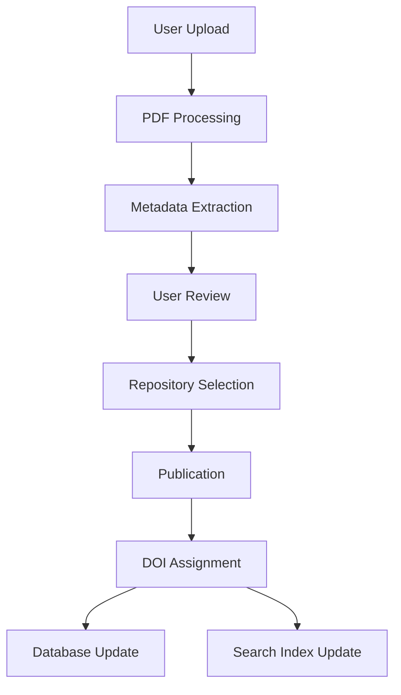

# Submission Portal

The Posters.science submission service provides researchers with a streamlined workflow to upload, process, and publish their scientific posters. This section covers the submission portal architecture and functionality.

## Submission Process

The submission workflow follows a simple step-by-step process:

1. **[Upload & Processing](./workflow.md#step-2-upload-poster-file)** - Upload poster PDF and abstract
2. **[Metadata Review](./workflow.md#step-3-review-and-provide-metadata)** - Review and edit extracted metadata
3. **[Repository Selection](./workflow.md#step-4-sharing-poster)** - Choose target repository or local download
4. **[Publication](./workflow.md#step-4-sharing-poster)** - Publish to selected repository

### Data Flow

