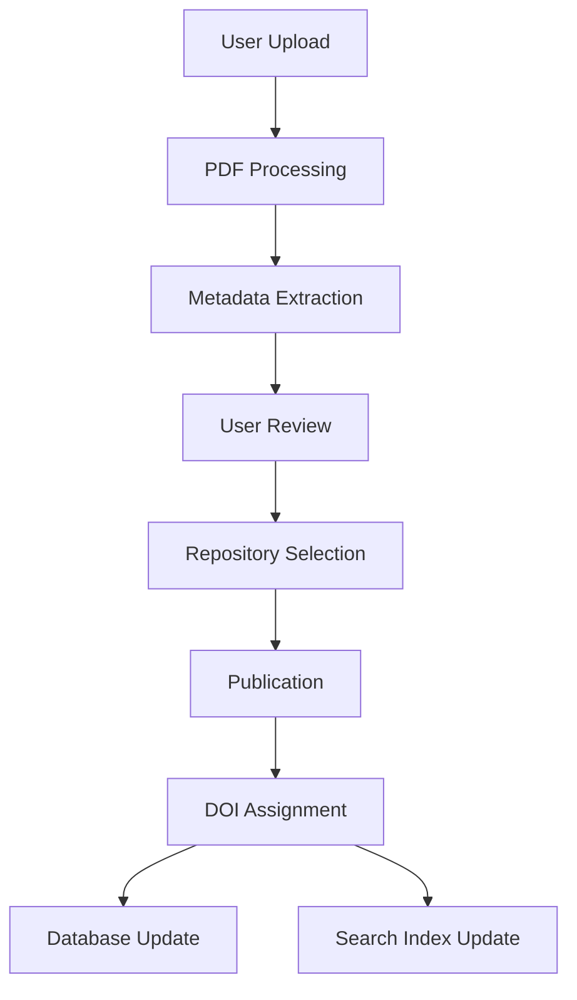

# Submission Portal

The Posters.science submission service provides researchers with a streamlined workflow to upload, process, and publish their scientific posters. This section covers the submission portal architecture and functionality.

## Overview

The submission service is integrated into the main platform. Researchers upload poster PDFs, and the system automatically extracts structured metadata using LLMs. The extracted information is stored in PostgreSQL and indexed in Meilisearch. Posters are published to repositories (Zenodo or Figshare) via APIs, with DOIs returned to users.

## Submission Process

The submission workflow follows a simple step-by-step process:

1. **Upload & Processing** - Upload poster PDF and abstract
2. **Metadata Review** - Review and edit extracted metadata with confidence indicators
3. **Repository Selection** - Choose target repository for deposit
4. **Publication** - Publish to selected repository

The platform generates a *poster.json* file following the Posters.science JSON Schema (based on DataCite with poster-specific extensions). Versioning is tracked in PostgreSQL.

### Data Flow

## Automated Metadata Extraction

The extraction tool uses Large Language Models to extract structured information from poster PDFs. The pipeline processes PDFs through parsing, layout analysis, OCR fallback, and language detection. Extracted text passes through our LLM system, which populates fields according to the *poster_schema.json* structure. Each field receives a confidence score (0-100%) based on format compliance, database validation, and context. Fields below 70% trigger user review.

### Model Performance

Through systematic evaluation on 200 posters from Zenodo and Figshare, Llama 3.3 70B significantly outperformed traditional NLP methods (Grobid) across all fields. The model is deployed on dual NVIDIA RTX 3090 GPUs using 4-bit quantization with vLLM for optimized inference. The 8,192-token context window allows processing substantial content, targeting under 60 seconds per poster.

### Extraction Strategy

The system uses adaptive prompting with specialized templates for different extraction tasks. Few-shot learning includes 3-5 example extractions selected based on similarity. Key strengths include handling irregular layouts, understanding scientific terminology, robustness to typos, and extracting information from context.

### External Database Integration

External database integration validates and enriches metadata through:

- **ORCID** - Author identification
- **ROR** - Institution validation
- **Crossref Funder Registry** - Funding validation

For U.S. federal funding, we cross-reference NIH Reporter and NSF Award Search.

### Content Structure

Poster content is stored in a **posterContent** object. The LLM extracts:
- **posterTitle**: The main title text as it appears on the poster
- **sections**: Array of content sections with flexible naming (e.g., "Introduction", "Methods", "Results", "Conclusions"), each containing a sectionTitle and sectionContent

Image and table captions are stored in separate arrays (imageCaption and tableCaption). This flexible structure accommodates the diverse, unstructured nature of scientific posters better than attempting to force content into predefined rigid sections.

### Technical Implementation

The tool is containerized in Docker with Python 3.10+, exposing RESTful API endpoints. Redis-based job queuing handles asynchronous processing. Rate limiting prevents abuse. The architecture supports horizontal scaling through multiple GPU instances.

## Poster Schema Design Rationale

The Posters.science JSON Schema (v0.1) was developed with the University of California Curation Center (UC3). The schema balances adherence to DataCite standards with unique poster metadata needs.

### Design Principles

- Every required field supports FAIR principles
- Extensibility through *additionalProperties*
- Poster-specific fields for gaps in general schemas
- JSON format optimized for human readability and AI/ML processing
- Interoperability through mapping to repository schemas

### Why DataCite?

DataCite was selected as the base because it's the industry standard for research output metadata (10M+ DOIs), provides comprehensive bibliographic coverage with strong identifier support (ORCID, ROR, DOI), and includes native funding reference support.

### Key Poster-Specific Extensions

**Conference Object**
- Captures name, location, dates, acronym, identifiers, and series information
- Mandatory: name, start/end dates

**Ethics Approvals**
- Array for IRB protocols and ethics certifications

**Domain Field**
- Primary research area categorization

**Poster Content**
- posterContent object with posterTitle and sections array
- Flexible section naming based on actual poster structure
- Accommodates unstructured poster layouts

**Image and Table Captions**
- Separate arrays (imageCaption and tableCaption) with multi-line caption support

### Identifiers

The identifiers array includes psID (Posters.science system identifier) as a mandatory identifier, serving as the primary database key. DOIs are added when deposited to repositories. Resource types default to "Other" since DataCite lacks "Poster" as an option.

### Repository Mapping

Most Posters.science fields map directly to Zenodo/Figshare or with minor transformations. For fields without equivalents (posterContent, ethics approvals, domain), the complete *poster.json* is included as a supplementary file. The schema follows semantic versioning, with each version archived on Zenodo.
