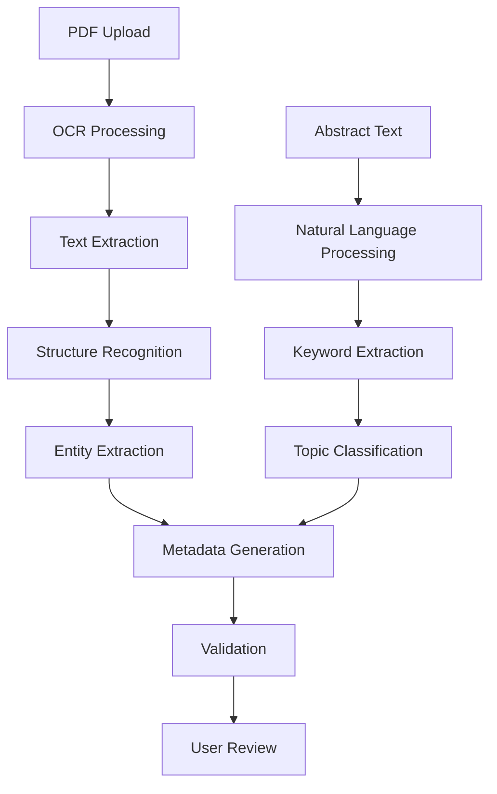

# Metadata Processing

The Posters.science platform uses advanced AI-powered processing to automatically extract, validate, and enrich metadata from scientific posters. This ensures FAIR compliance and optimal discoverability.

## AI-Powered Extraction

### Content Analysis Pipeline

### Features

- **High-Accuracy Text Recognition**: Advanced OCR for poster text extraction
- **Multi-language Support**: Recognition of various languages and scripts
- **Layout Preservation**: Maintains document structure and formatting
- **Image Processing**: Handles charts, graphs, and visual elements

### Natural Language Processing

- **Entity Recognition**: Automatic identification of authors, institutions, and dates
- **Topic Classification**: AI-powered subject categorization
- **Keyword Extraction**: Automatic keyword and phrase identification
- **Abstract Summarization**: Content summarization and enhancement

## Processing Workflow

### 1. Initial Extraction

- **File Analysis**: PDF structure and content analysis
- **Text Recognition**: OCR processing and text extraction
- **Layout Detection**: Section and element identification
- **Quality Assessment**: Content completeness evaluation

### 2. Entity Recognition

- **Author Extraction**: Name and affiliation identification
- **Institution Detection**: Organization and department recognition
- **Date Parsing**: Publication and event date extraction
- **Location Identification**: Geographic and venue information

### 3. Content Analysis

- **Topic Classification**: Subject area determination
- **Keyword Generation**: Automatic keyword extraction
- **Abstract Enhancement**: Content summarization and improvement
- **Reference Parsing**: Citation and bibliography analysis

### 4. Validation and Enrichment

- **Data Validation**: Format and completeness checking
- **External Lookup**: ORCID, DOI, and database integration
- **Standardization**: Controlled vocabulary mapping
- **Quality Scoring**: Metadata completeness assessment
