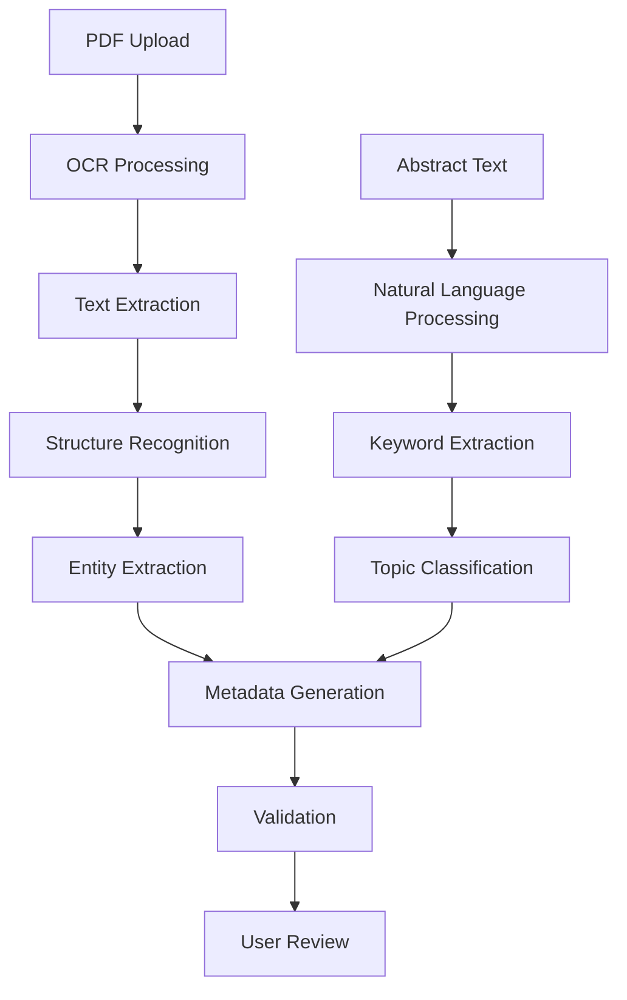

# Metadata Processing

The Posters.science platform uses advanced AI-powered processing to automatically extract, validate, and enrich metadata from scientific posters. This ensures FAIR compliance and optimal discoverability.

## AI-Powered Extraction

### Large Language Model

The extraction tool uses **Llama 3.3 70B** for structured information extraction from poster PDFs. The model is deployed on dual **NVIDIA RTX 3090 GPUs** using 4-bit quantization with **vLLM** for optimized inference. The 8,192-token context window allows processing substantial content, targeting **under 60 seconds per poster**.

### Model Performance

Through systematic evaluation on 200 posters from Zenodo and Figshare, Llama 3.3 70B significantly outperformed traditional NLP methods (Grobid) across all fields.

### Extraction Strategy

The system uses adaptive prompting with specialized templates for different extraction tasks. Few-shot learning includes 3-5 example extractions selected based on similarity. Key strengths include:
- Handling irregular layouts
- Understanding scientific terminology
- Robustness to typos
- Extracting information from context

### Content Analysis Pipeline

### Features

- **High-Accuracy Text Recognition**: Advanced OCR for poster text extraction
- **Multi-language Support**: Recognition of various languages and scripts
- **Layout Preservation**: Maintains document structure and formatting
- **Image Processing**: Handles charts, graphs, and visual elements

### Natural Language Processing

- **Entity Recognition**: Automatic identification of authors, institutions, and dates
- **Topic Classification**: AI-powered subject categorization
- **Keyword Extraction**: Automatic keyword and phrase identification
- **Abstract Summarization**: Content summarization and enhancement

## Processing Workflow

### 1. Initial Extraction

- **File Analysis**: PDF structure and content analysis
- **Text Recognition**: OCR processing and text extraction
- **Layout Detection**: Section and element identification
- **Quality Assessment**: Content completeness evaluation

### 2. Entity Recognition

- **Author Extraction**: Name and affiliation identification
- **Institution Detection**: Organization and department recognition
- **Date Parsing**: Publication and event date extraction
- **Location Identification**: Geographic and venue information

### 3. Content Analysis

- **Topic Classification**: Subject area determination
- **Keyword Generation**: Automatic keyword extraction
- **Abstract Enhancement**: Content summarization and improvement
- **Reference Parsing**: Citation and bibliography analysis

### 4. Validation and Enrichment

- **Data Validation**: Format and completeness checking
- **External Lookup**: ORCID, DOI, and database integration
- **Standardization**: Controlled vocabulary mapping
- **Quality Scoring**: Metadata completeness assessment

## Confidence Scoring

Each extracted field receives a confidence score (0-100%) based on:
- **Format Compliance**: Adherence to expected data formats
- **Database Validation**: Verification against external databases
- **Context Analysis**: Consistency with surrounding information

Fields below 70% confidence trigger user review during the submission process.

## External Database Integration

The system validates and enriches metadata through integration with authoritative databases:

- **ORCID**: Author identification and profile linking
- **ROR (Research Organization Registry)**: Institution validation and standardization
- **Crossref Funder Registry**: Funding agency validation

For U.S. federal funding, the system cross-references:
- **NIH Reporter**: National Institutes of Health grant information
- **NSF Award Search**: National Science Foundation award data

## Content Structure

Poster content is stored in a **posterContent** object with the following structure:

- **posterTitle**: The main title text extracted from the poster itself
- **sections**: Array of content sections, each with:
  - **sectionTitle**: Heading as it appears on the poster (e.g., "Introduction", "Methods", "Results & Discussion", "Conclusions")
  - **sectionContent**: Text content of that section

This flexible structure accommodates the diverse, unstructured nature of scientific posters without forcing content into predefined rigid sections.

### Image and Table Captions

Captions are stored in separate arrays:
- **imageCaption**: Array of objects containing multi-line image captions (caption1, caption2, etc.)
- **tableCaption**: Array of objects containing multi-line table captions (caption1, caption2, etc.)

## Technical Implementation

The metadata extraction tool is containerized in **Docker** with **Python 3.10+**, exposing RESTful API endpoints. Key features include:

- **Redis-based job queuing**: Asynchronous processing of extraction requests
- **Rate limiting**: Prevention of abuse and resource exhaustion
- **Horizontal scaling**: Support for multiple GPU instances
- **API endpoints**: RESTful interface for submission integration
