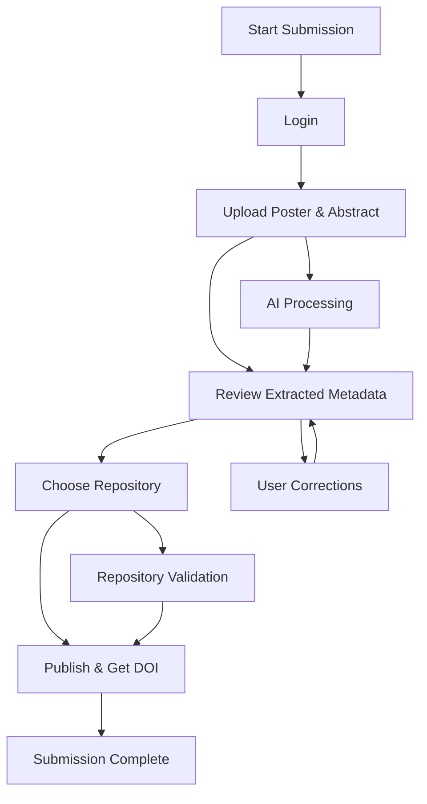

# Submission Workflow

The Posters.science submission workflow is designed to be intuitive and efficient, guiding researchers through the process of uploading, processing, and publishing their scientific posters.

## Step 1: Login

The first step is to log in to the user's account. Login is required to enforce rate limits and prevent excessive usage of the platform's AI/LLM-based tools. The account also allows users to track and make updates to their previously shared posters.

## Step 2: Upload Poster File

In the second step, the user will upload the PDF file of their poster through a drag-and-drop interface or through a file navigation option. They will also be able to optionally upload a PDF file containing the abstract of their poster.

### Accepted File Formats

Posters.science accepts the following file formats for poster uploads:

#### Primary Formats (Recommended)

| Format | Extension | Notes |
|--------|-----------|-------|
| **PDF** | `.pdf` | Most common poster format. Must be single-page. |
| **PNG** | `.png` | Lossless image format. |
| **JPEG** | `.jpg`, `.jpeg` | Widely used image format. |
| **TIFF** | `.tiff`, `.tif` | High-quality, print-ready. |
| **PowerPoint** | `.pptx` | Must be single-slide. |
| **SVG** | `.svg` | Vector format from Figma/Illustrator. |

#### Additional Supported Formats

| Format | Extension | Notes |
|--------|-----------|-------|
| PowerPoint Legacy | `.ppt` | Older PowerPoint format. |
| OpenDocument | `.odp` | LibreOffice/OpenOffice presentations. |
| Keynote | `.key` | Apple Keynote (macOS). |
| EPS | `.eps` | Encapsulated PostScript vector. |
| WebP | `.webp` | Modern web image format. |
| GIF | `.gif` | Limited colors, rare for posters. |
| BMP | `.bmp` | Uncompressed bitmap. |
| HEIF | `.heic`, `.heif` | Apple high-efficiency format. |

#### Page/Slide Requirements

For multi-page formats (PDF, PPTX, PPT, ODP, KEY), only **single-page/single-slide documents** are accepted as valid posters. Multi-page documents are automatically flagged for review.

#### Design Tool Exports

If you created your poster in design software like Figma, Adobe Illustrator, or Canva, we recommend exporting as:

1. **PDF** (preferred) - maintains quality and is widely compatible
2. **SVG** - preserves vector quality
3. **PNG** - high-resolution raster fallback

## Step 3: Review and Provide Metadata

At the third step, the user will wait while the platform automatically extracts metadata from their PDF file(s). Once completed, the user will be presented with an editable form of conveniently organized metadata through multiple sections. Metadata that was automatically extracted will be prefilled in the form.

### Confidence Indicators

Each extracted field receives a confidence score (0-100%) based on:
- Format compliance
- Database validation
- Context analysis

Fields below 70% confidence are flagged for user review. The user will be able to review and edit prefilled metadata as well as add additional metadata.

### Generated Output

The platform generates a **poster.json** file following the Posters.science JSON Schema (based on DataCite with poster-specific extensions). This file contains all structured metadata and ensures FAIR compliance. Versioning is tracked in PostgreSQL for all metadata changes.

## Step 4: Sharing Poster

On the fourth step, the user will be able to share their poster package on a repository or download it locally on their computer.

### Repository Options

Users can choose to publish their poster to:
- **Zenodo** - Open research repository
- **Figshare** - Research data repository

Posters are published via repository APIs, and a DOI (Digital Object Identifier) is returned to the user upon successful publication. The DOI and repository information are stored in the database and indexed in the search system.

### Local Download

Alternatively, users can download the complete poster package (PDF and poster.json file) locally for manual repository submission or archival purposes.

## AI-Powered Metadata Extraction

Posters.science uses Large Language Models (LLMs) to automatically extract key details such as authors, affiliations, and funding information from posters. This transforms each poster into structured, machine-readable metadata.

## Standards-Based Metadata

Posters.science follows the standard DataCite schema to structure metadata. This ensures that posters are not only FAIR (Findable, Accessible, Interoperable, and Reusable) but also easier to find, index, and reuse.

### Poster Schema

The Posters.science JSON Schema extends DataCite with poster-specific fields including:
- **Conference information** - Name, location, dates, and identifiers
- **Ethics approvals** - IRB protocols and certifications
- **Domain classification** - Research area categorization
- **Content structure** - Text blocks, figure and table captions

The complete schema is available at: [https://github.com/fairdataihub/posters-science-json-schema](https://github.com/fairdataihub/posters-science-json-schema)
