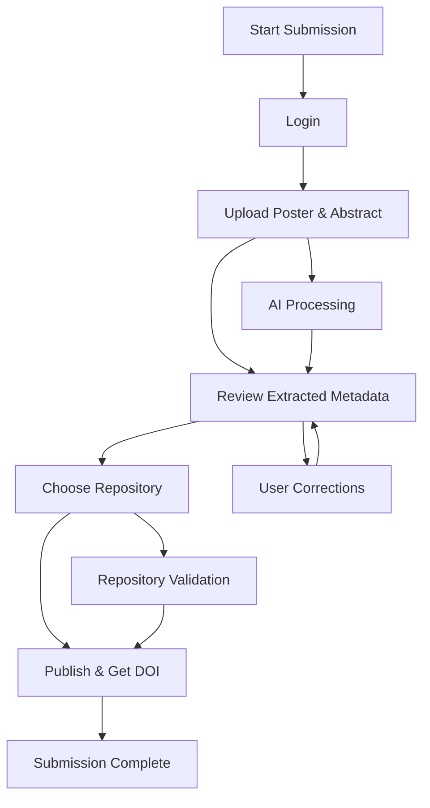

# Submission Workflow

The Posters.science submission workflow is designed to be intuitive and efficient, guiding researchers through the process of uploading, processing, and publishing their scientific posters.

## Step 1: Login

The first step is to log in to the user's account. Login is required to enforce rate limits and prevent excessive usage of the platform's AI/LLM-based tools. The account also allows users to track and make updates to their previously shared posters.

## Step 2: Upload Poster File

In the second step, the user will upload the PDF file of their poster through a drag-and-drop interface or through a file navigation option. They will also be able to optionally upload a PDF file containing the abstract of their poster.

## Step 3: Review and Provide Metadata

At the third step, the user will wait while the platform automatically extracts metadata from their PDF file(s). Once completed, the user will be presented with an editable form of conveniently organized metadata through multiple sections. Metadata that was automatically extracted will be prefilled in the form. The user will be able to review and edit prefilled metadata as well as add additional metadata.

## Step 4: Sharing Poster

On the fourth step, the user will be able to share their poster package on a repository or download it locally on their computer.

## AI-Powered Metadata Extraction

Posters.science uses Large Language Models (LLMs) to automatically extract key details such as authors, affiliations, and funding information from posters. This transforms each poster into structured, machine-readable metadata.

## Standards-Based Metadata

Posters.science follows the standard DataCite schema to structure metadata. This ensures that posters are not only FAIR (Findable, Accessible, Interoperable, and Reusable) but also easier to find, index, and reuse.
